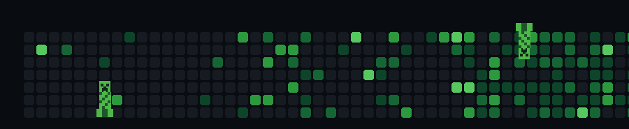

<h1 align="center">Hi 👋, I'm Granth Chhabra</h1>

<h3 align="center">
Computer Science Engineering Student • AI & Machine Learning Enthusiast • Building Intelligent Applications
</h3>

  

---

# 👨‍💻 About Me

- 🎓 B.Tech Computer Science Engineering Student
- 🤖 Passionate about Artificial Intelligence, Machine Learning and Generative AI
- 🧠 Exploring Agentic AI, LLMs and Retrieval-Augmented Generation (RAG)
- 🚀 Love building projects that solve real-world problems
- 🌱 Currently learning advanced LangGraph, AI evaluation and production AI systems

---

  

---

# 💻 Languages

  
  
  

---

# 🤖 AI / Machine Learning

  
  
  
  

---

# ⚙️ Frameworks & Libraries

  
  
  
  
  
  
  
  
  
  

---

# 🛠 Tools

  
  
  
  
  

---

# 🚀 Featured Projects

- 🐙 **Scout** — Smart Commerce & Omnichannel Unified Tracker
- 🎬 **Content-Based Movie Recommendation System**
- 💬 **ConversaAI** — Neural Network Chatbot
- 📈 **Stock Market Prediction**
- 📊 **Time Series Forecasting using LSTM**
- 📹 **YouTube Video RAG Chatbot**
- ✋ **Real-Time Hand Sign Recognition using MediaPipe**
- 📉 **Customer Churn Prediction**

---

# 📜 Certifications

- IBM — Unleashing the Power of AI Agents
- IBM — Introduction to Large Language Models
- IBM — Build Your First Chatbot
- IBM — Getting Started with Generative AI
- NVIDIA — Getting Started with AI on Jetson Nano
- Cisco — Introduction to Cybersecurity
- Kaggle — Intermediate Machine Learning
- Kaggle — Intro to Machine Learning
- Kaggle — Intro to Deep Learning
- Kaggle — Machine Learning Explainability
- Kaggle — Intro to SQL
- Kaggle — Intro to Game AI & Reinforcement Learning

---

# 📊 GitHub Stats

  

---

# 📫 Connect With Me

  <a href="https://www.linkedin.com/in/granth-chhabra-8915a9377/">
    🔗 LinkedIn
  </a>
  •
  <a href="mailto:chhabragranth729@gmail.com">
    📧 Email
  </a>

---

  <i>"Building intelligent software that solves real-world problems."</i>

  ⚡ <b>Keep coding. Keep building. Keep exploding bugs.</b> 💥

